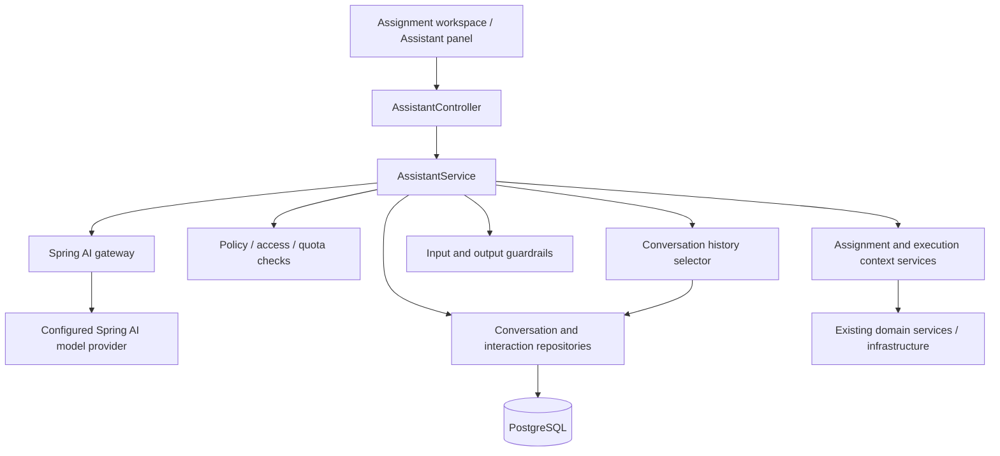

# AI Educational Assistant — Implementation Plan

Status: implementation in progress. Stages 0–8 implemented; PostgreSQL-specific schema/concurrency verification remains outstanding. Live Gemini qualification and disclosure/consent (stage 9), and rollout remain pending. Global assistant switch defaults off.

This plan incorporates the confirmed decisions from the planning discussion based on `docs/AI_PROMPT.md`. Remaining choices are explicitly marked **pending**. Proposed defaults are recommendations, not approved requirements.

## Confirmed decisions

- Preserve selected decisions from the earlier plan, not all of them.
- Professor-configured quota has an upper bound of 10; successfully delivered answers, including educational redirections, consume quota. Failed, rejected, and canceled requests do not.
- One ongoing conversation per student and assignment.
- Professor controls enabled/disabled state, quota, and one of three assistance levels: conceptual only; explanations and guiding without code; explanations, guiding, and code snippets.
- Short assignment-specific snippets are allowed only at the code-snippet level; complete solutions remain prohibited.
- Send public assignment context. Send current editor code and the student's latest non-pending execution for that assignment only when the student opts into each context source separately.
- Never send private tests or reference solution code.
- Use educational redirection for prohibited requests and allow one regeneration after output rejection.
- Google Gemini is the selected backend provider, via the Spring AI 1.1.8 Google GenAI starter. Keep the gateway provider-neutral and the Gemini model configurable. Display answers only after output checks finish.
- Only the student may read their conversation; professor access is a possible future feature.
- No new assistance after assignment closure, group archival, or enrollment ending. Usage never resets. Conversation text remains until group archival or logical deletion, then is permanently erased; unarchiving never restores it. Retain content-free usage records.
- Store prompts blocked by input guardrails for traceability, without storing assembled prompts, editor code, execution details, or other context.
- Model-based semantic guardrail checks are permitted.
- Disabled assignments have quota `0`.
- Cancel a pending answer when changed policy makes the request incompatible with the new policy.

## 1. Current architecture

Backend root: `codehive-backend/src/main/java/com/github/codehive/`.

| Area | Existing implementation | Integration consequence |
|---|---|---|
| Runtime | Spring Boot 3.5.11, Java 21, Gradle Kotlin DSL | Use Spring AI 1.1.8 Google GenAI starter behind the `ChatModel` gateway |
| Architecture | Controllers → services → JPA repositories/infrastructure services | Add assistant within existing backend |
| Identity | JWT filter loads `User`; controllers receive `Authentication` | Derive student identity exclusively from authenticated principal |
| Authorization | Group ownership; active student enrollment; assignment visibility rules | Reuse domain rules; distinguish new requests from historical access |
| Assignments | `Assignment`, public examples, languages, constraints, hints, tags, schedules | Existing public data supplies assignment context |
| Assignment updates | Immediate metadata changes; staged reference/test changes | AI policy updates need immediate application independent of worker validation |
| Execution | `ExecutionRequestService`, `ExecutionResultService`, `ExecutionRepository` | Retrieve controlled execution context through services |
| Storage/messaging | `ObjectStorageService`, RabbitMQ producers/listeners | Assistant has no direct infrastructure access |
| API conventions | Request validation, DTOs/mappers, `SuccessResponse`, `ErrorResponse`, `GlobalExceptionHandler` | Extend existing conventions |
| Rate limiting | `RateLimitInterceptor`, Bucket4j, authenticated-user buckets | Reuse existing mechanism |
| Database schema | Flyway dependencies and baseline configuration; Hibernate `ddl-auto=update`; no migration scripts found | Update the development schema directly; no Flyway migration required for this feature |
| Tests | JUnit, Mockito, Spring Security tests, H2; frontend Vitest/Testing Library | Extend existing suites; add PostgreSQL concurrency coverage |

Key source references:

- [Assignment.java](../codehive-backend/src/main/java/com/github/codehive/model/entity/Assignment.java)
- [AssignmentService.java](../codehive-backend/src/main/java/com/github/codehive/service/AssignmentService.java)
- [AssignmentUpdateService.java](../codehive-backend/src/main/java/com/github/codehive/service/AssignmentUpdateService.java)
- [ExecutionRequestService.java](../codehive-backend/src/main/java/com/github/codehive/service/ExecutionRequestService.java)
- [RateLimitInterceptor.java](../codehive-backend/src/main/java/com/github/codehive/ratelimit/RateLimitInterceptor.java)

Existing assignment creation persists metadata and uploads reference/test artifacts, then requests asynchronous worker validation. AI settings belong to assignment metadata; changing them must not trigger execution, reference validation, reevaluation, or grade clearing.

Frontend already provides `/assignment/:id`, Monaco editor, execution results, and a disabled AI control in [AssignmentPage.tsx](../codehive-frontend/app/features/student/pages/AssignmentPage.tsx). Student API client already handles bearer authentication and response wrappers.

The existing assistant plan is partially superseded: stateless requests, backend-only scope, provider selection, and allowing incompatible pending answers to finish no longer apply.

## 2. Proposed architecture

Keep the feature inside the Spring Boot backend. Introduce no new microservice, vector database, execution queue, or LLM tools.



The LLM receives bounded data, not callable backend capabilities. The application determines identity, context, permissions, quota, and persistence.

Recommend one persistent `AssistantConversation` per student-assignment pair. It supplies conversation identity, ordering, and a concurrency lock. Avoid separate conversation and quota aggregates with overlapping ownership.

## 3. Complete request lifecycle

1. Student opens the assistant panel. Frontend loads availability, quota, and paginated own history.
2. Student enters a message and separately opts into sharing current editor code and latest execution context as desired.
3. Frontend submits message, selected language, both opt-in flags, optional editor text, and client-generated idempotency UUID.
4. Backend authenticates the student and validates request shape and size.
5. Backend checks for an existing request with the same idempotency UUID. A matching retry returns existing state; changed payload returns conflict.
6. For a new request, backend verifies active enrollment, active assignment/group, non-archived group, assignment readiness/publication, close date, enabled policy, and available quota.
7. A short reservation transaction creates a `PENDING` interaction under the conversation lock.
8. Backend constructs public assignment context. If execution sharing was selected, it finds the latest non-pending execution initiated by this student for this assignment and constructs a safe projection; otherwise it does not retrieve execution details for the model.
9. Backend selects bounded conversation context compatible with current policy.
10. Input guardrails classify the request as allowed, requiring educational redirection, or blocked. Persist the student's original prompt when guardrails block it; end the interaction without a model call or quota charge.
11. Context builder assembles server-owned instructions plus clearly separated untrusted content.
12. Spring AI invokes the configured model.
13. Output guardrails validate the complete buffered answer.
14. If output fails validation, allow one regeneration. Recheck access/policy before another transmission.
15. Revalidate the request and answer against latest policy and lifecycle state.
16. Final transaction verifies reservation ownership, current policy version, quota, access, and deadline; persists the terminal result.
17. Return only a committed, validated answer. UI renders it and replaces displayed quota with backend values.

No database transaction remains open during model calls, model-based validation, or MinIO downloads.

If eligibility disappears or new policy disallows the request/answer, mark the interaction canceled, withhold generated content, and consume no successful-answer quota.

## 4. Domain and data model

### Assignment policy

Implementation uses one-to-one `AssignmentAiPolicy` keyed by assignment ID. This keeps the policy version independent of `Assignment.version`: existing staged worker validation compares that assignment version, so a direct policy edit must not invalidate an in-flight reference/test validation. Create/clone cascade the policy; direct policy updates do not write the assignment row.

Policy fields:

| Field | Purpose |
|---|---|
| `aiAssistanceEnabled` | Explicit professor switch |
| `maxAiRequests` | Integer quota, upper bound 10 |
| `aiAssistanceLevel` | Server-defined enum |
| `aiPolicyVersion` | Policy row `@Version`, changed whenever effective AI policy changes |

Disabled assignments, including existing assignments, have `maxAiRequests=0`; enabled assignments require `1..10`. Disabling sets quota to `0` without clearing lifetime usage. Re-enabling requires a new `1..10` value; earlier charged requests still count.

Confirmed levels:

| Level | Allowed |
|---|---|
| `CONCEPTUAL_ONLY` | Explain relevant concepts and terminology; do not give assignment-specific steps, pseudocode, or snippets |
| `EXPLANATIONS_AND_GUIDING` | Explain assignment concepts, errors, algorithms, edge cases, and give guiding questions or hints; no code or pseudocode |
| `EXPLANATIONS_GUIDING_AND_SNIPPETS` | All guiding help plus short assignment-specific snippets and pseudocode; no complete solution |

Complete solutions remain prohibited at every level.

Use one server-owned capability mapping for policy checks, prompts, output validation, and frontend descriptions. The client cannot submit custom capabilities or system instructions.

### AssistantConversation

Proposed table: `assistant_conversations`.

| Field | Purpose |
|---|---|
| `id UUID` | Standard project primary key |
| `assignment_id UUID` | Required assignment FK |
| `student_id UUID` | Required user FK |
| `next_sequence BIGINT` | Stable interaction order |
| `created_at`, `updated_at` | UTC `Instant` timestamps |

Constraints:

- Unique `(assignment_id, student_id)`.
- Required foreign keys.
- No cascade deletion through ordinary assignment/group logical deletion.
- Repository method acquiring a pessimistic write lock.

No duplicate `successfulCalls` counter initially. Interaction records supply authoritative usage.

### AssistantInteraction

Proposed table: `assistant_interactions`.

| Field | Purpose |
|---|---|
| `id UUID` | Interaction identity |
| `conversation_id UUID` | Parent conversation |
| `sequence BIGINT` | Stable chronological ordering |
| `client_request_id UUID` | Retry deduplication |
| `request_fingerprint` | Detect reuse of request ID with different message, language, editor opt-in/content, or execution opt-in |
| `student_message TEXT`, nullable after purge | Student's original prompt, including input-guardrail-blocked prompts; permanently erased on group archival/deletion |
| `assistant_response TEXT`, nullable | Canonical validated response JSON; permanently erased on group archival/deletion |
| `status` | `PENDING`, `COMPLETED`, `REDIRECTED`, `BLOCKED`, `FAILED`, `CANCELLED` |
| `quota_charged BOOLEAN` | Explicit accounting fact |
| `failure_code` | Safe machine-readable failure category |
| `requested_policy_version` | Policy at acceptance |
| `completed_policy_version` | Policy used for final release |
| `editor_context_included BOOLEAN` | Records opt-in use |
| `execution_context_included BOOLEAN` | Records separate opt-in use |
| `execution_id UUID`, nullable | Latest eligible non-pending student execution selected by backend only after opt-in |
| `language` | Requested, validated language |
| `generation_attempts` | Initial generation plus at most one regeneration |
| `provider_id`, `model_id` | Optional audit metadata |
| `input_tokens`, `output_tokens` | Nullable provider-reported usage |
| `created_at`, `completed_at`, `lease_expires_at` | Lifecycle/recovery timestamps |

Constraints/indexes:

- Unique `(conversation_id, client_request_id)`.
- Unique `(conversation_id, sequence)`.
- Partial unique index on `conversation_id WHERE status = 'PENDING'`.
- History index `(conversation_id, sequence DESC)`.
- Recovery index on pending `lease_expires_at`.
- Check that `quota_charged=true` applies only to delivered `COMPLETED` or `REDIRECTED` rows; blocked/failed/canceled/pending rows never charge quota.
- Enforce at most two answer-generation attempts.

Persist only the student's original prompt as request text. Do not persist raw editor context, execution diagnostics, assignment context, assembled model prompts, rejected model output, credentials, or raw provider exceptions. Structured metadata and the validated student-visible answer are allowed until archival/deletion.

Prompt/answer text may itself contain code. “Do not persist editor attachments” cannot guarantee “no code exists in conversation storage.” On archive or logical deletion, clear both text fields while retaining interaction IDs, statuses, timestamps, and `quota_charged` values.

### Schema rollout

The project is in development. Use the current Hibernate `ddl-auto=update` behavior for new entities and columns; no Flyway migration is needed. Apply database changes directly when Hibernate cannot express or reliably update an existing constraint, partial unique index, or backfill. [Development SQL](AI_ASSISTANT_DEV_SCHEMA.sql) covers existing-assignment backfill, PostgreSQL partial indexes, and checks; it has not yet been executed in a reachable PostgreSQL environment.

Development schema checklist:

1. Add JPA entities/columns, then inspect generated PostgreSQL schema on both an existing development database and a fresh database.
2. Set existing assignments to AI disabled with `max_ai_requests=0` before enforcing non-null requirements.
3. Create and verify unique constraints, partial pending-interaction index, foreign keys, and check constraints. Use explicit development SQL where required.
4. Test populated and fresh databases, including quota concurrency and schema constraints.
5. Verify conversation text columns can become null after purge while usage rows remain intact.
6. Keep schema changes documented so later production migration work can reproduce them. Disable the feature to roll back behavior without deleting usage records.

## 5. Backend changes

Suggested new classes follow existing package conventions.

| Class/package | Responsibility |
|---|---|
| `controller/AssistantController` | Student request, availability, interaction lookup, history |
| `service/AssistantService` | Coordinates full lifecycle |
| `service/AssistantTransactionService` | Reservation, finalization, recovery transactions |
| `service/assistant/AssistantPolicyEvaluator` | Maps levels to capabilities; evaluates request/output |
| `service/assistant/AssistantContextBuilder` | Bounded public assignment/editor/execution context |
| `service/assistant/AssistantHistorySelector` | Policy-compatible history window |
| `service/assistant/AssistantInputGuardrail` | Educational-scope and injection checks |
| `service/assistant/AssistantOutputGuardrail` | Schema, capability, solution-disclosure checks |
| `service/assistant/AssistantModelGateway` | Small provider-neutral application interface |
| `service/assistant/SpringAiAssistantModelGateway` | Spring AI integration |
| `service/assistant/AssistantTextPurgeService` | Clear prompt/answer text on group archive or logical deletion without changing charged usage |
| `config/AssistantProperties`, `AssistantConfig` | Validated configuration and conditional wiring |
| `repository/AssistantConversationRepository` | Pair lookup, locking, safe creation |
| `repository/AssistantInteractionRepository` | History, usage count, idempotency, recovery |
| `model/request/assistant/*` | Validated request contracts |
| `model/dto/assistant/*` | Safe response/context DTOs |
| `model/enums/*` | Policy levels, lifecycle/failure enums |
| `resources/prompts/assistant/*` | Versioned educational prompts |

Modify/reuse:

- `Assignment`, assignment DTOs/mappers and create/clone requests: expose AI configuration.
- `AssignmentService`: persist configuration and produce minimal authorized public context without loading reference/private artifacts.
- `AssignmentUpdateService`: integrate policy updates without stale staged metadata overwriting newer policy.
- `GroupService`: call `AssistantTextPurgeService` from archive and soft-delete paths within the group-state transaction; unarchive/restore never repopulates text.
- `ExecutionRepository`: latest own non-pending assignment execution query for opted-in context.
- `ExecutionRequestService`: controlled assistant execution-context method.
- `GlobalExceptionHandler`: assistant errors using existing wrappers.
- Existing rate-limit annotation/interceptor: dedicated assistant policy.
- Relevant `llms/backend` documentation.

Recommend a dedicated owner-authorized policy update endpoint:

`PUT /api/assignments/{assignmentId}/ai-policy`

This allows immediate disable/level changes while test-suite updates are validating. Existing assignment edit UI can invoke it separately. Creation/cloning still includes initial policy.

Policy update authorization follows existing group-owner rules, including eligible student owners.

## 6. API and frontend

### Proposed API

| Endpoint | Behavior |
|---|---|
| `GET /api/assignments/{id}/assistant` | Availability, policy, quota, pending interaction |
| `POST /api/assignments/{id}/assistant/interactions` | Submit one message |
| `GET /api/assignments/{id}/assistant/interactions` | Paginated own history; content-free metadata after group archive/deletion |
| `GET /api/assignments/{id}/assistant/interactions/{interactionId}` | Recover result after timeout/reload while text is retained; return content-erased status after archive/deletion |
| `PUT /api/assignments/{id}/ai-policy` | Owner updates policy immediately |

Request:

```json
{
  "clientRequestId": "00000000-0000-0000-0000-000000000001",
  "message": "Why does my loop miss the last item?",
  "language": "JAVA",
  "includeEditorCode": true,
  "includeExecutionContext": true,
  "editorCode": "..."
}
```

No student ID, policy, quota, assignment description, or authoritative execution report is accepted from the frontend.

The editor and execution checkboxes default off independently. When editor opt-in is false, the frontend omits editor text and the backend rejects contradictory nonempty editor payloads. `includeExecutionContext=false` means the backend sends no execution details to the model. The frontend never submits an execution ID or report as authoritative context.

Response includes:

- Interaction ID, status, sequence, timestamps.
- Validated answer or safe failure/redirection; after group archival/deletion, only interaction metadata and `contentErased=true`.
- `{maximum, used, reserved, remaining}` quota.
- Current availability and policy version.
- Context indicators: editor included, execution requested/included or unavailable, context truncated.

Recommended error distinctions:

| Status | Meaning |
|---|---|
| `400` | Invalid request |
| `403` | Unauthorized new assistance |
| `404` | Inaccessible resource/history |
| `409` | Request pending, idempotency conflict, policy/lifecycle cancellation |
| `429` | Quota exhausted or rate limit; distinct error codes |
| `502` | Output rejected after regeneration |
| `503` | Provider unavailable/global feature disabled |
| `504` | Provider timeout |

A successful POST returns the committed result. A duplicate pending request returns pending state without starting another model call.

### Frontend components

Create under `app/features/student/`:

- `api/assistant.api.ts`
- `types/assistant.types.ts`
- `hooks/useAssignmentAssistant.ts`
- `components/AssistantPanel.tsx`
- `components/AssistantMessage.tsx`
- `components/AssistantComposer.tsx`
- `components/AssistantQuota.tsx`

Integrate into the existing assignment workspace and replace the disabled AI control. Preserve responsive desktop/mobile layout.

UI states:

- Loading history/availability.
- Ready.
- Sending/checking answer.
- Educational redirection.
- Disabled by professor.
- Quota exhausted.
- Closed/enrollment-ended with readable conversation text while group remains active; archived/deleted with content-erased history metadata only.
- Provider error.
- Policy changed while processing.
- Recovery after network interruption.

Code-sharing and execution-context controls default off independently. Capture editor text and both opt-in states at send time; later UI changes do not mutate the pending request.

Reuse the student API client, extending `ApiError` to preserve machine-readable error code and `Retry-After` when relevant.

Render code as escaped text or read-only code blocks. Do not render model HTML or execute snippets. Never automatically insert generated code into the editor.

Teacher create/edit/clone pages gain an enable switch, quota input, assistance-level selector, and level explanation. No teacher conversation viewer.

Historical access needs route support: the current assignment page may fail its normal assignment fetch after enrollment ends. Provide a student-only history view that can load directly from conversation ownership without requiring current assignment access. After group archival/deletion, show prior interaction dates and statuses with a clear “Conversation content erased” state; unarchiving keeps this state.

## 7. Spring AI integration

Use Spring AI **1.1.8** compatible with Boot **3.5.x**. Google Gemini is selected through `spring-ai-starter-model-google-genai`; the domain gateway still depends only on Spring AI `ChatModel`. `ASSISTANT_MODEL_PROVIDER=google-genai` selects the provider, `GEMINI_API_KEY` supplies its API key, and `GEMINI_MODEL` selects a supported model (default `gemini-2.5-flash`). Without explicit provider selection, `spring.ai.model.chat=none` and no credentials are needed. See [Spring AI 1.1 Google GenAI configuration](https://docs.spring.io/spring-ai/reference/1.1/api/chat/google-genai-chat.html).

The application gateway accepts bounded context and returns a candidate answer plus safe usage metadata. Implementation uses `ChatClient`/`ChatModel`; domain services import no provider-specific types. `ChatClient` supports buffered calls and response metadata. See [ChatClient reference](https://docs.spring.io/spring-ai/reference/api/chatclient.html).

Use provider-neutral structured conversion for response shape, followed by application validation. Provider-native JSON/structured-output features may be enabled only when supported; the assistant must also work through portable text generation plus parsing and validation. Structured JSON does not prove educational compliance.

Spring AI supplies advisor and memory integration mechanisms, but conversation persistence here has additional authorization, quota, and validation requirements. Recommend explicit selected-history messages initially, with PostgreSQL interaction records as the source of truth. Avoid automatic memory persistence of unchecked model output. See [chat memory reference](https://docs.spring.io/spring-ai/reference/api/chat-memory.html).

Current online documentation includes 2.x APIs. Implementation must verify selected methods against pinned 1.1.x artifacts.

Configuration includes:

- Global enable switch.
- Gemini model and API key through Spring AI configuration, isolated from application services.
- Context/output budgets.
- Transport deadlines.
- Reservation lease duration.
- Prompt and guardrail versions.
- Rate limits.
- Maximum concurrent provider calls.

When disabled, the backend starts without provider credentials. When enabled, startup verifies that exactly one intended `ChatModel` is configured and required provider settings exist. Automated tests use a fake gateway. Disable hidden answer-generation retries so the total remains the initial attempt plus one approved regeneration.

## 8. Guardrail strategy

### Deterministic validation

Enforce identity, authorization, quota, sizes, language, separate editor/execution opt-ins, allowed context fields, and lifecycle state before model invocation.

Suggested configurable starting limits: 2,000 message characters and 32,768 editor characters. Validate independently from token budgets; do not silently truncate editor code.

### Input guardrails

Detect full-solution requests, role spoofing, off-topic requests, prompt injection, and prohibited assistance level.

Educational redirection should remain useful: explain permitted help or ask the student to identify a specific obstacle.

Keyword matching alone is insufficient: legitimate questions may quote adversarial text. Use deterministic checks for objective constraints and model-based semantic classification for contextual violations. A blocked request stores the student's original prompt and safe classification metadata, but sends no answer and consumes no quota.

### Prompt instructions

Server-owned instructions define:

- Educational role and current capabilities.
- No complete/submittable solutions.
- Assignment context as data, not instructions.
- Student message, code comments, diagnostics, and earlier messages as untrusted.
- No private-test inference, reference-solution claims, tool use, or instruction disclosure.

### Output guardrails

Validate:

- Response schema and bounded size.
- Required explanation around snippets.
- Allowed capabilities for the current level.
- Complete-solution behavior across prose, pseudocode, and snippets.
- Attempts to split a full solution across repeated responses.
- Instruction leakage and unsupported private-data claims.
- Unsafe rendered markup/links.

Short code can solve a short assignment completely. Line counts and entry-point detection are supplementary checks, not proof.

Use model-based semantic output review against the assignment, request, policy, and previous approved assistance. Bound reviewer calls, latency, and token budget; reviewer input follows the same context limits and privacy rules as generation. Deterministic validation remains authoritative for objective policy limits.

If the first candidate fails, regenerate once with server-owned violation guidance. Do not send rejected content to the browser or append it to history. A second failure becomes a terminal, uncharged failure.

Guardrails cannot guarantee perfect pedagogical compliance. Release criteria need adversarial evaluation and an agreed acceptable failure threshold.

## 9. Quota and concurrency

Confirmed maximum: **10 successful answers per student-assignment**, with the professor choosing the allowance. Usage has no resets. Archiving, deleting, restoring, or unarchiving a group, editing assignment dates, and changing the configured quota do not reset charged usage.

Recommended implementation:

1. Create the conversation safely using database uniqueness and conflict-safe insert.
2. Lock the conversation row.
3. Read current maximum and count interactions with `quota_charged=true`.
4. Detect an unexpired pending interaction.
5. Reject when quota is exhausted or another request is pending.
6. Insert a pending interaction and allocate sequence atomically.
7. Commit before external work.
8. On successful finalization, lock the conversation and pending interaction, recheck quota/current policy, persist the answer and set `quota_charged=true` in the same transaction.
9. Failure/cancellation releases the reservation without charging.

At most one pending interaction per conversation makes model context ordering deterministic and prevents concurrent overspending across backend instances.

Use database counts under lock, not `count()` followed by unlocked insert, browser values, JVM locks, or Bucket4j counters.

Idempotency:

- Same request ID + same original payload: return existing state.
- Same request ID + different payload: conflict.
- Regeneration remains the same interaction and can charge at most once.
- Transport retry never invokes the model again for a completed interaction.
- Backend-selected execution/context are frozen for the original request; a newer execution must not make a legitimate retry conflict. Both opt-in flags are part of the original request fingerprint.

Recovery:

- Pending rows carry lease expiration.
- Scheduled/opportunistic recovery marks expired work failed.
- Late provider completion cannot finalize an expired/canceled interaction.
- Finalizer verifies exact pending interaction identity.
- Client disconnect alone does not establish whether commit succeeded; the frontend retrieves the existing interaction.

If transaction commit outcome is uncertain, query by idempotency key before retrying finalization.

Successfully delivered educational redirections count as successful answers and use one request. Blocked input, invalid input, provider failure, rejected output, and cancellation use none. Store the original prompt for input-guardrail-blocked requests without sending model context or charging quota.

On group archival or logical deletion, erase all interaction prompt/answer text while retaining each interaction's ID and `quota_charged` value (or an equivalent durable count). Example: after three charged answers are erased, the student still has used three of ten requests. Unarchiving does not restore text or quota. Keep content-free records so usage never resets.

## 10. Persistence and conversation context

Persist an accepted request's original student prompt before provider invocation. Persist the approved response and quota charge atomically before returning it. Persist input-guardrail-blocked prompts with `BLOCKED` status and no answer or quota charge. Do not persist editor code, execution diagnostics, assignment content, or assembled prompts.

History and model context differ:

- History exposes the student's retained interactions and safe failure states until group archival/deletion; afterward it exposes only content-free metadata.
- The model receives bounded selected turns.
- Failed/rejected raw outputs never enter model history.
- Historical content is filtered against the current assistance level.
- Editor and execution attachments are request-specific; never silently reuse earlier code or diagnostics when opt-in is off.

Recommend recent complete turns under a token budget, reserving space for system instructions, assignment, current message, execution summary, and output. Prefer dropping oldest complete turns over splitting messages.

No summarization initially: the allowance is small, and summaries introduce another model call and potential policy leakage. If needed later, summaries require the same privacy and output checks.

Repeated-request reconstruction checks may inspect broader retained approved history than the generation window, within a separate bounded budget. The student should receive notice when older context is omitted. After text erasure, do not reconstruct or resend erased turns; use only later interactions and retained non-content metadata.

### Group archive and deletion retention

`GroupService.setArchived(true)` and `GroupService.softDelete(...)` must trigger a set-based purge of `student_message` and `assistant_response` for all assignments in that group in the same transaction as the group-state change. This applies to completed, redirected, blocked, failed, and pending interactions. `setArchived(false)` and `restore(...)` do not restore content. If a restored group remains archived, no new assistant request is accepted until it is unarchived; charged usage remains unchanged throughout.

The purge also cancels pending interactions. Coordinate group-state and assistant-finalization locks so no late model response can repopulate erased text after the archive/delete commit. Idempotent retries of purged interactions return content-erased metadata without rerunning the model. Any new request after later unarchiving begins with empty text history but the same lifetime used count.

### Latest execution context

The student sees an independent “Include my latest execution result” checkbox, off by default. Only when selected does the backend find the latest **non-pending, student-initiated** execution for the authenticated student and assignment. It uses that execution for this request only. The frontend does not choose an execution ID or supply a report. If none exists, report context unavailable and continue without execution details.

Safe projection:

- Execution ID/type/status/time.
- Runtime/memory summary.
- Bounded approved compilation diagnostic.
- Approved practice diagnostics.
- Explicit expired/unavailable marker when a selected execution's detailed artifact cannot be used.

Exclude private inputs, expected outputs, reference source, storage keys, raw definitive stdout, and raw definitive stderr. Definitive stderr can echo hidden input; existing report redaction alone is insufficient.

Never fetch saved submission source as a substitute for editor opt-in. Ignore pending executions when selecting the latest result; do not include automatic reevaluations because they were not initiated by the student. If the latest eligible execution's report has expired, include only its safe persisted summary rather than choosing an older execution.

## 11. Security and policy changes

The frontend is untrusted for identity, policy, quota, context, and execution ownership. The model is untrusted for instructions, structured fields, code, and links.

Student-only history checks conversation ownership directly. Professor ownership, admin scopes, and general assignment visibility do not grant conversation access.

New requests require current eligibility; historical reads do not require active enrollment or an open assignment. After group archival/deletion, historical reads expose metadata only because conversation text has been permanently erased. Authentication still applies.

Policy changes need two checks:

1. Before each model transmission.
2. Before persisting/releasing an approved answer.

For finalization, compare the evaluated policy version with the latest version under transaction locks. If changed, evaluate against the new policy outside locks, then retry the final check. Bound repeated rechecks; cancel if state keeps changing.

Coordinate short locking of relevant group, assignment, enrollment, and conversation rows in a documented order. Lifecycle writers must not bypass serialization assumptions. PostgreSQL tests must prove races against close-date edits, archive/deletion purge, enrollment removal, and policy updates. A pending answer cannot write text after archival purge.

Finalization is the defined release point. Changes committed before that point govern the answer. Content already transmitted to the provider or delivered to the browser cannot be recalled.

Do not log prompts, editor text, answers, diagnostic payloads, or provider credentials. Log interaction ID, safe failure code, latency, attempts, and token usage. Apply the same restrictions to tracing.

The existing rate limiter is process-local; it does not provide a deployment-wide provider spending cap. Durable quota remains PostgreSQL-enforced. Global cost/concurrency limits need deployment-specific configuration.

## 12. Testing plan

| Layer | Required coverage |
|---|---|
| Policy | Every approved level; short snippet versus complete solution; enabled/disabled behavior |
| Assignment | Create/clone/defaults; immediate policy updates; pending test update cannot overwrite newer policy |
| Persistence | UUID/FK/unique constraints; ordering; terminal-state invariants; blocked prompt stored without context; archival text erasure and content-free history |
| Quota | Final slot race; duplicate request; first conversation race; delivered redirection charges once; blocked prompt charges zero; archive/unarchive never resets usage; failure release; regeneration charges once |
| Recovery | Expired lease, delayed provider response, uncertain commit, application restart |
| Access | Own versus other student; owner/admin denied history; post-enrollment history allowed |
| Lifecycle | Exact close boundary; archive/deletion during model call cannot restore purged text; unarchive cannot restore text/quota; enrollment removal; compatible/incompatible policy changes |
| Context | Public-only assignment; both opt-ins independent and default off; latest non-pending student-initiated execution only when selected; private stderr/stdout excluded |
| Conversation | Bounded complete turns; current-policy filtering; cross-assignment isolation |
| Guardrails | Direct solutions, disguised debugging, instruction override, code-comment injection, multi-turn reconstruction; bounded semantic input/output review |
| Gateway | Malformed JSON, empty/truncated output, timeout, provider failure, two-generation maximum; provider-neutral fake `ChatModel` contract |
| API | Status/error contracts, idempotency, safe response fields, quota display |
| Frontend | Separate editor/execution opt-in payloads, history loading, safe code rendering, quota exhaustion, cancellation, network recovery |

Use fixed UUIDs and injected clocks. Standard tests never call an external model.

Add a PostgreSQL integration suite for locks, partial indexes, concurrent creation, and schema constraints on fresh and existing development databases; H2 is insufficient proof.

The rate-limit interceptor is disabled under the current `test` profile, so test it explicitly rather than relying on ordinary controller integration tests.

Gemini selection still requires gated model evaluation against representative assignments and adversarial cases. Deterministic fake-model tests alone do not validate real model compliance.

## 13. Implementation stages

Build in reviewable stages. Keep global AI switch off through stages 1–8. Tests use a fake model, so those stages do not depend on choosing a provider. Resolve external-provider disclosure/consent before real student content reaches a provider in stage 9; its unanswered status does not block schema, domain, or fake-model work.

| Stage | Goal and affected components | Depends on | Focused verification / exit condition |
|---|---|---|---|
| 0. Contract | Freeze API DTOs, assistance-level semantics, charged versus uncharged statuses, content-erasure behavior, configuration names, and error codes in docs. Record external-provider disclosure/consent as release gate. | None | [Contract](AI_ASSISTANT_STAGE_0_CONTRACT.md) covers success, redirection, blocked prompt, provider failure, policy change, archive, and retry. |
| 1. Assignment policy | Add independent `AssignmentAiPolicy` row/defaults, create/clone/update DTOs and mapper. Implement immediate owner-authorized `PUT /api/assignments/{id}/ai-policy`; keep staged worker updates from overwriting newer AI policy. | 0 | Create/clone/disable/re-enable and owner-access tests pass. Existing assignments start disabled with quota `0`; policy-only change invokes no worker and clears no grades. |
| 2. Conversation records and erasure | Add `AssistantConversation`/`AssistantInteraction`, repositories, direct development schema changes, history read APIs, blocked-prompt status, and transactional group archive/delete text purge. Keep usage metadata after purge. | 0; can proceed alongside 1 | PostgreSQL schema/index tests and API ownership tests pass. Archive/delete clears text, cancels pending records, preserves charged count; unarchive restores neither text nor quota. |
| 3. Quota and retry engine | Implement conversation-row reservation lock, charged-interaction count, idempotency, lease expiry/recovery, and finalization transactions in `AssistantTransactionService`. No model call yet. | 1, 2 | Concurrent first-row and final-slot tests prove quota never exceeds configured limit. Retry does not double charge; blocked/failed/canceled rows charge zero; delivered redirection charges once. Implemented; PostgreSQL race/index proof pending. |
| 4. Safe context | Add public assignment projection, separately opted-in editor data, latest non-pending student execution projection, and bounded retained-history selection. | 1, 2 | Service tests prove private test/reference exclusion, no context without opt-in, no automatic reevaluation, correct expired-artifact handling, and no reuse of erased turns. Implemented; PostgreSQL query proof pending. |
| 5. Model boundary and guardrails | Implement `AssistantModelGateway`, Spring AI adapter, versioned prompts, deterministic checks, bounded semantic review, structured parsing, output validation, and one regeneration. Use fake `ChatModel` in automated tests. | 1, 4 | Adversarial fixtures for full solutions, injection, snippet limits, policy levels, and multi-turn reconstruction pass. No unchecked answer released; reviewer calls/time/token budget bounded. Implemented with Spring AI 1.1.8 model API; real-model qualification remains stage 9. |
| 6. Backend request flow | Implement `AssistantService`, `AssistantController`, error mapping, rate limit, final eligibility/policy recheck, and read/POST contracts. Wire stages 2–5 with fake model. | 2–5 | Implemented. Controller integration tests cover completion/replay, blocked prompts, policy downgrade, archive during generation, timeout, and role denial. Global switch remains off by default. |
| 7. Professor controls | Add enable/disable, level, and quota controls to teacher create/edit/clone flows. Reuse existing assignment forms and owner-authorized API. | 1; may run alongside stages 2–6 | Implemented. Shared policy fields validate `1..10`; disabled sends `0`. Create/clone include initial policy; edit saves it immediately through owner-authorized endpoint. Frontend tests cover fields and payloads. |
| 8. Student assistant UI | Replace disabled AI control with panel, composer, separate editor/execution opt-ins, quota, history, code rendering, and recovery/error states. | 6; can proceed alongside 7 | Implemented. Panel reads availability and paginated history, polls pending results, and refreshes history after interrupted requests. Distinct opt-ins default off; no answer appears before backend validation; archive shows erased-content metadata; closed/enrollment-ended blocks new requests while permitted history remains available. Vitest, typecheck, and build pass. |
| 9. Provider qualification | Gemini provider is selected and backend configuration added. Resolve disclosure/consent, set real credentials, timeouts and budgets, and evaluate live-model quality/safety without changing domain contracts. | 5, 6; may run alongside 7–8 after consent decision | Deployment configuration starts cleanly with provider enabled; real-model evaluation meets agreed quality threshold; provider failure and cost limits verified. Normal CI still uses fake model. |
| 10. Rollout | Run affected backend/frontend checks, PostgreSQL race and archive tests, verify docs and operational monitoring, then enable the global switch for rollout. | 6–9 | Existing assignments remain disabled, erasure and no-reset behavior hold, rollback by switch works, and no sensitive prompt/context appears in logs. |

Critical path: **0 → 1/2 → 3/4 → 5 → 6 → 8/9 → 10**. Stage 7 needs only stage 1 and can be reviewed while backend work continues. Stage 9 needs actual provider and disclosure/consent decision, but no earlier stage needs live credentials. Each stage should produce one focused review; keep the global switch disabled until stage 10.

Relevant commands during implementation:

- Backend: `./gradlew test`, affected build/check tasks.
- Dedicated PostgreSQL integration task.
- Frontend: `npm run test`, `npm run typecheck`, `npm run build`.
- Refresh relevant `llms/` docs and graph after implementation.

## 14. Remaining decisions

External-provider disclosure/consent requirement remains unspecified. Resolve it before connecting a real provider; it affects student UI, request authorization, and deployment policy.

Gemini is the selected provider. Each deployment can select a Gemini model supported by the pinned Spring AI Google GenAI starter, subject to configuration and safety qualification.
